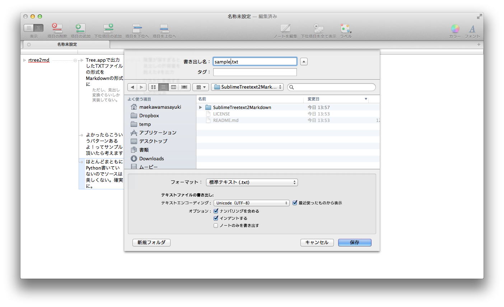
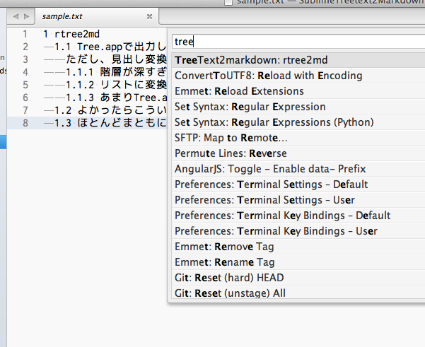

SublimeTreetext2Markdown
========================

Tree.appで出力したTXTファイルをマークダウンの雛形に変換

コマンド
: ```TreeText2markdown```

## 利用方法

### Tree.appでTextファイルを出力

<br>「ナンバリングを含める」「インデントする」を有効にしてTextファイルを保存

<br>コマンドパレットで```TreeText2markdown```を実行

<br>ざっくり変換する

### 見出しをリストに変換

<br>変換対象の見出しを選択し、```TreeText2markdown: rtreeheader2list```を実行

<br>見出しのレベルを反映した入れ子の状態に変換

## インストール

### Package Control

公式レポジトリへの登録は今のところは予定なしです。

Package Controlで```https://github.com/maepon/SublimeTreetext2Markdown```をAdd RepositoryするとPackage Controlからのインストールが可能になります。

### 手動インストール

**Zip 解凍してインストール**: [github](https://github.com/maepon/SublimeTreetext2Markdown) から zip ファイルをダウンロードして、"Packages" フォルダ内に解凍すれば OK です。

**Git でインストール**: "Packages" フォルダに下記のコマンドで clone してください。

    git clone git://github.com/maepon/SublimeTreetext2Markdown.git SublimeTreetext2Markdown
