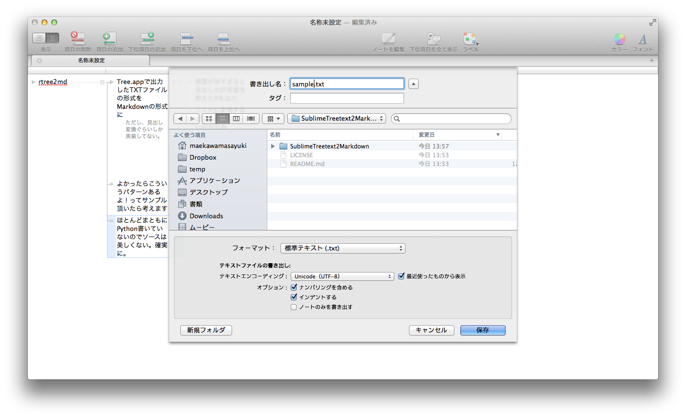
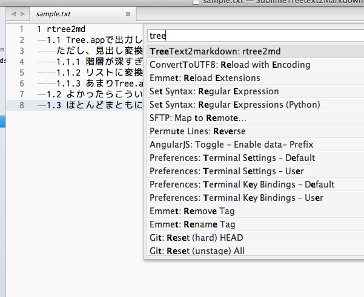
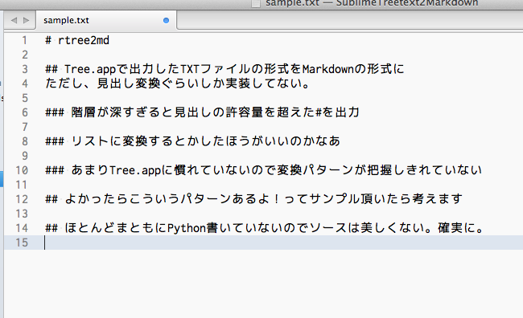

SublimeTreetext2Markdown
========================

Tree.appで出力したTXTファイルをマークダウンの雛形に変換

コマンド
: ```TreeText2markdown```

## 利用方法

### Tree.appでTextファイルを出力


: 「ナンバリングを含める」「インデントする」を有効にしてTextファイルを保存


: コマンドパレットで```TreeText2markdown```を実行


: ざっくり変換する


## インストール

### Package Control

今のところは予定なしです。

### 手動インストール

**Zip 解凍してインストール**: [github](https://github.com/maepon/SublimeTreetext2Markdown) から zip ファイルをダウンロードして、"Packages" フォルダないに解凍すれば OK です。

**Git でインストール**: "Packages" フォルダに下記のコマンドで clone してください。

    git clone git://github.com/maepon/SublimeTreetext2Markdown.git SublimeTreetext2Markdown
