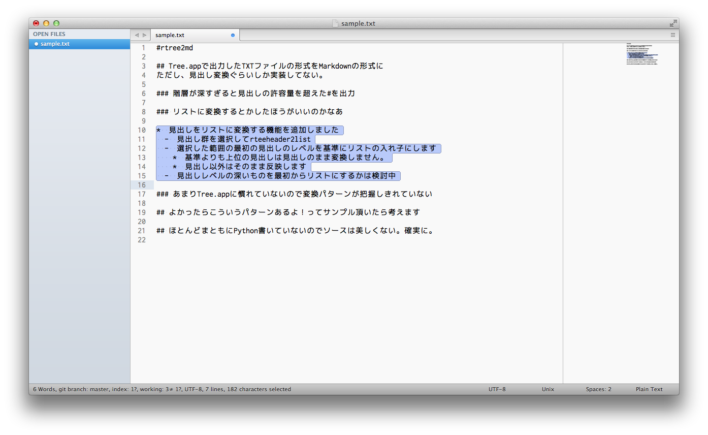

SublimeTreetext2Markdown
========================

Convert template for mark down the TXT file that was output by Tree.app

Command
: ```TreeText2markdown```

## How to Use

### The output TXT file in the Tree.app

<br>Check 「Include Numbering」「Append Indent」

<br>Run ```TreeText2markdown```.

<br>Conversion complete

### Convert to list a heading.

<br>Select the heading to be converted.　And run ```TreeText2markdown: rtreeheader2list```.

<br>Conversion complete

## Installation

### With the Package Control

Comming soon ...

### Manually

Without Git: Download the latest source zip from github and extract the files to your Sublime Text "Packages" directory, into a new directory named SublimeNFDToNFCPaste.

**Without Git:**: Download the latest source zip from [github](https://github.com/maepon/SublimeTreetext2Markdown) and extract the files to your Sublime Text "Packages" directory, into a new directory named SublimeTreetext2Markdown.

**With Git**: "Clone the repository in your Sublime Text "Packages" directory:

    git clone git://github.com/maepon/SublimeTreetext2Markdown.git SublimeTreetext2Markdown
